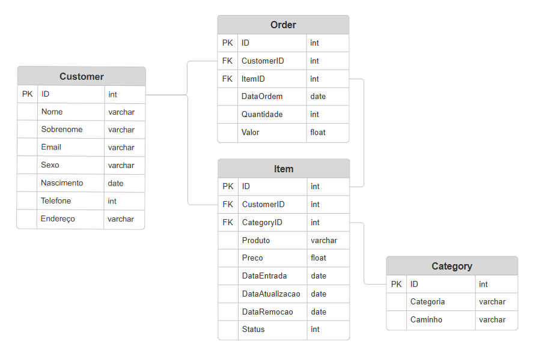

# Challenge Engineer - Primera Parte - SQL <h1>

Projeto desenvolvido para a primeira parte do desafio do Mercado Livre.

A DER abaixo foi desenhada com o objetivo de atender as regras e responder as questões de negócio passadas no desafio.

**Tabela Customer**: Armazena informações sobre todos os clientes cadastrados no site.
**Tabela Category**: Armazena as categorias para os itens.
**Tabela Item**: Armazena os itens cadastrados no site. Faz referência ao usuários (Customer) por meio da chave estrangeira CustomerID, e as categorias de cada produto (Category) por meio da chave estrangeira CategoryID.
**Tabela Order**: Armazena os pedidos (orders), referenciando os clientes (Customer) por meio da chave estrangeira CustomerID e os itens (Item) por meio da chave estrangeira ItemID 